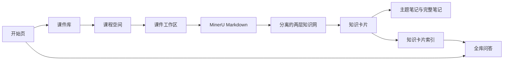

# 多课程知识库、两层知识网与卡片 RAG 设计

日期：2026-07-14  
状态：已确认

## 1. 背景与问题

当前应用围绕单个课件和单份全局状态运行：`App.tsx` 根据一个 `stage` 直接切换页面，`useStore.ts` 保存一个当前项目，`persistence.ts` 将整个状态写入单个 `localStorage` 键。虽然类型中已经存在 `courseId`、`SourceDocument[]`、`CourseKnowledgeBase` 和 `KnowledgeCard.embeddingId` 等字段，但它们尚未形成可管理的多课程知识库。

现有知识结构和笔记还有两条明确断链：

1. `buildExpandedKnowledgeNetwork` 将一级课程节点和二级教学节点合并后交给同一画布，造成两层网络在视觉和交互上混杂。
2. 二级网络已经生成 `TopicNarrativePath.orderedTeachingBlockIds`，但知识卡片和主题笔记仍按原始数组顺序处理；`TopicSynthesis.orderedCardIds` 也没有真正驱动后续组装，因此完整笔记没有依据二级结构重排。

本次设计将应用升级为本地优先的多课程知识库，并增加基于全部知识卡片的问答能力。

## 2. 已确认的产品原则

- 一个课程空间可以包含多份 PDF 或 PPTX 课件。
- 每份课件独立保留原文件、MinerU Markdown、处理状态、错误和来源位置。
- 一级课程知识网和二级知识点内部网在数据与画布上完全分离。
- 点击一级节点后，二级网络替换当前画布；点击左上角关闭按钮返回一级网络。
- 知识卡片是二级结构与完整笔记之间的中间产物。
- 完整笔记以一级网遍历顺序为主线，每个一级知识点严格按照对应二级网的叙事顺序编排。
- 全库问答优先检索知识卡片；命中时显示可跳转的卡片索引，未命中时允许 DeepSeek 直接回答。
- 基于卡片的回答与 AI 通用回答必须在界面上明确区分。

## 3. 功能与非功能需求

### 3.1 功能需求

1. 提供独立开始页，展示新建课程、导入课件、最近课程和全库问答入口。
2. 提供课件库页面，按课程空间管理多份课件。
3. 课件文件具有上传、预览、MinerU 解析、知识结构、知识卡片和笔记等独立状态。
4. 课程空间聚合各课件的一级主题实例、知识卡片、术语、公式和完整笔记。
5. 一级网与每个一级主题的二级网分别保存、分别遍历和分别渲染。
6. 完整笔记能够证明每个段落使用了哪些知识卡片，并验证卡片没有遗漏或重复。
7. 全库问答能够检索所有已完成的知识卡片，并支持课程、课件和主题过滤。
8. 答案中的卡片引用可打开知识卡片，并继续定位到原课件来源。

### 3.2 非功能需求

- 本地优先、单浏览器可用，不引入服务器和登录系统。
- 课件与结构化数据不能继续依赖单个 `localStorage` 大对象。
- 页面刷新后，课程、文件、处理进度和生成产物能够恢复。
- 单个课件失败不能破坏同一课程中的其他课件。
- 知识卡片更新后只重建受影响的索引与笔记。
- API 密钥只保存在本地配置中，界面必须掩码显示，日志和错误不得输出完整密钥。
- 设计通过 Repository 接口隔离存储实现，未来可以迁移到后端数据库。

## 4. 总体架构



前端仍保持单体 React 应用。Zustand 只负责当前路由、当前课程、选中节点和弹窗等临时 UI 状态；业务实体和生成结果通过 Repository 写入 IndexedDB。

建议引入清晰的路径状态，即使暂不使用 React Router，也应在应用层拥有等价的路由模型：

```text
/
/library
/courses/:courseId
/courses/:courseId/documents/:documentId/:stage
/qa
```

## 5. 页面设计

### 5.1 开始页

- 主操作：新建课程、导入课件、进入全库问答。
- 最近课程：课程名、课件数量、已完成卡片数量、更新时间。
- 处理任务：正在解析、生成失败、等待继续的课件。
- 知识库概览：课程数、课件数、一级主题数、知识卡片数。

### 5.2 课件库

- 左侧课程列表或筛选器，右侧展示当前课程的文件。
- 每个文件显示类型、页数、MinerU 状态、知识结构状态、卡片数量和更新时间。
- 支持多文件导入、打开、重试、重命名、移入其他课程和删除。
- 删除前展示影响范围；删除课件只删除其来源实例，并重新计算课程级聚合结构。

### 5.3 课程空间

- “课件”页签：进入某份课件的处理流程。
- “课程知识网”页签：展示多课件聚合后的一级网。
- “知识卡片”页签：按一级主题和来源课件筛选。
- “完整笔记”页签：展示课程级最终笔记与生成版本。

### 5.4 全库问答

- 左侧：会话和课程过滤。
- 中间：问题、答案以及“基于知识卡片”“AI 通用回答”来源标签。
- 右侧：答案引用的知识卡片；点击卡片来源后打开课件原文。

## 6. IndexedDB 数据模型

不直接将一个完整项目序列化成单值，而是建立以下逻辑仓库：

```text
CourseRepository
DocumentRepository
SourceFileRepository
ParseArtifactRepository
KnowledgeGraphRepository
KnowledgeCardRepository
NoteRepository
RetrievalIndexRepository
ChatRepository
JobRepository
SettingsRepository
```

核心实体：

```typescript
interface Course {
  id: string;
  name: string;
  description?: string;
  documentIds: string[];
  createdAt: number;
  updatedAt: number;
}

interface CourseDocument {
  id: string;
  courseId: string;
  title: string;
  fileType: 'pdf' | 'pptx';
  sourceFileId: string;
  status: DocumentStatus;
  activeVersions: {
    parse?: number;
    graph?: number;
    card?: number;
    note?: number;
  };
}
```

原始二进制文件继续由 IndexedDB Blob 存储；MinerU Markdown、图结构、卡片和笔记分别版本化。Repository 方法必须按 `courseId`、`documentId` 和版本查询，避免加载整个知识库。

### 6.1 旧数据迁移

首次启动新版本时检查旧的 `zhigang_project_state`：

1. 为旧项目创建一个默认课程空间。
2. 将当前课件迁移为一个 `CourseDocument`。
3. 保留能够验证的 MinerU、图、卡片和笔记版本。
4. 迁移成功后记录 migration marker，但暂不立即删除旧快照。
5. 迁移失败时继续允许读取旧项目，并提供重试入口。

## 7. 多课件知识聚合

每份课件先独立生成文档级候选主题。课程级聚合阶段不会强制合并原文，而是创建课程主题和来源实例：

```text
CourseTopic: GLM
├── TopicOccurrence: lecture2 / GLM
├── TopicOccurrence: lecture5 / Generalized Linear Models
└── TopicOccurrence: lecture8 / 广义线性模型
```

AI 可根据名称、别名、定义与关系建议合并，但合并结果必须保存每个 `TopicOccurrence`。低置信度候选保持分离，不能静默覆盖。知识卡片仍绑定具体课件来源，同时通过课程主题参与课程级导航和问答过滤。

## 8. 两层知识网

### 8.1 一级课程知识网

```typescript
interface CourseGraph {
  courseId: string;
  topics: CourseTopic[];
  relations: MacroRelation[];
  traversalOrder: string[];
  version: number;
}
```

一级节点只表示可形成独立学习目标的课程知识。每个节点可以关联多个课件实例，但不包含二级节点数组。

### 8.2 二级主题知识网

```typescript
interface TopicGraph {
  courseId: string;
  topicId: string;
  blocks: TeachingBlock[];
  relations: MicroRelation[];
  narrativeOrder: string[];
  version: number;
}
```

二级节点类型由 AI 根据内容概括，不受固定枚举限制；可以是公式、组成部分、条件、推导步骤、代表模型、案例、局限或其他合理教学单元。

### 8.3 展示规则

- 课程知识网模式只向画布传入 `CourseGraph`。
- 点击一级节点后切换为 `TopicGraph` 模式，画布数据被替换而不是合并。
- 顶部显示 `课程知识网 / 当前主题` 面包屑。
- 二级画布左上角显示关闭按钮，关闭后返回一级网。
- 右侧证据面板根据当前层级节点查询其来源。
- 两张网分别显示自身遍历序号，不保留“推荐路径”按钮。

应废弃或改造当前将两层数组拼接的 `buildExpandedKnowledgeNetwork`，防止其他页面再次误用。

## 9. 知识卡片与笔记顺序链

顺序必须成为显式数据，而不是提示词中的建议：

```text
TopicGraph.narrativeOrder
→ ordered TeachingBlock IDs
→ ordered KnowledgeCard IDs
→ ordered TopicNoteSection IDs
→ CourseGraph.traversalOrder
→ 完整课程笔记
```

知识卡片生成器必须接受对应的 `TopicNarrativePath`，并为卡片记录 `narrativeIndex`。主题笔记生成前，程序先按 `narrativeOrder` 建立卡片序列，再把有序卡片与二级关系发送给模型。

```typescript
interface TopicNoteSection {
  id: string;
  topicId: string;
  title: string;
  cardIds: string[];
  relationReason: string;
  markdown: string;
}
```

生成结果执行确定性校验：

- 每张输入卡片恰好出现一次。
- 卡片顺序不违反二级叙事顺序。
- 模型输出的卡片 ID 都属于当前主题。
- 重复卡片被移除，遗漏卡片按原叙事顺序补回。
- 并列分支先生成共同框架，再分别讲解。
- 对比关系形成对比段或表格。
- 推导关系保持起点、步骤和结论连续。

完整笔记先给出课程框架，再按一级网遍历顺序组合主题笔记。章节编织仅处理导读、过渡、并列总结、对比、术语统一、公式统一和阶段性回顾，不能自由打乱主题内部顺序。

## 10. 知识卡片索引与问答

### 10.1 索引结构

第一版采用本地全文索引和结构关系扩展，不强制增加向量模型配置。

```typescript
interface RetrievalRecord {
  cardId: string;
  courseId: string;
  documentIds: string[];
  topicId: string;
  teachingBlockId: string;
  title: string;
  content: string;
  keywords: string[];
  aliases: string[];
  sourceRanges: SourceRange[];
  version: number;
}
```

需要建立两类索引：

1. 检索索引：关键词、别名、一级主题、二级节点和卡片全文指向 `KnowledgeCard ID`。
2. 来源索引：`KnowledgeCard ID` 指向课程、课件、一级主题、二级节点和原文位置。

检索链：问题规范化 → BM25/全文候选 → 全局知识锚点别名匹配 → 一级与二级网一跳扩展 → DeepSeek 重排序 → 选择卡片。

### 10.2 回答来源规则

问答允许两类来源：

- **基于知识卡片**：将命中卡片正文和卡片 ID 传给 DeepSeek，答案段落绑定可点击的卡片引用。
- **AI 通用回答**：没有命中卡片时由 DeepSeek 直接回答，并明确显示“当前回答未引用课件知识卡片”。

部分命中时答案分成“基于课件知识卡片”和“AI 补充说明”两个区域。卡片引用只能引用本次检索实际返回的卡片，不能伪造。知识网只用于检索扩展，不直接伪装成事实来源。

知识卡片版本改变时，只重建该卡片对应的 `RetrievalRecord`。删除课件时删除其卡片索引，并重新计算受影响的课程主题和全局锚点。

## 11. 状态、错误与恢复

每份课件拥有独立阶段状态：

```text
uploaded → parsed → graph_ready → cards_ready → notes_ready
```

每个阶段另有 `idle/running/succeeded/failed/stale` 状态。上游版本变化时，下游标为 `stale`，而不是立即清空已有结果。用户可以查看旧结果并选择重新生成。

主要失败处理：

| 失败 | 处理 |
| --- | --- |
| MinerU 解析失败 | 保存错误、重试次数和上次成功版本，不影响其他文件 |
| AI 输出非法 JSON | 提取 JSON、一次修复调用、仍失败则保存原始响应摘要 |
| 课程主题合并失败 | 保留文档级主题，允许稍后重新聚合 |
| 卡片顺序不完整 | 按二级叙事顺序确定性修复并记录警告 |
| 索引损坏 | 根据知识卡片重建，卡片本身不丢失 |
| 浏览器存储不足 | 停止新写入，提示导出或删除文件，不破坏已提交事务 |

## 12. 测试策略

### 12.1 单元测试

- 旧单项目状态迁移为课程与课件实体。
- 一级、二级节点不会出现在同一画布输入中。
- `narrativeOrder` 能稳定映射到卡片与主题章节。
- 笔记卡片覆盖校验能发现遗漏、重复和非法 ID。
- 课件删除后只移除相关索引与来源实例。
- 问答引用只能指向本次命中的知识卡片。

### 12.2 集成测试

- 创建课程并连续导入 PDF、PPTX 两份课件。
- 单份课件处理失败时，课程空间和其他课件仍可打开。
- 从一级网下钻二级网、查看来源、关闭返回一级网。
- 更新二级叙事顺序后，知识卡片和主题笔记按新顺序重建。
- 全库问答分别验证完全命中、部分命中和完全未命中三种结果。

### 12.3 回归测试

- 现有 PDF/PPTX 预览与滚动不退化。
- MinerU、DeepSeek 配置可以继续使用。
- 原有示例课程能够迁移或重新加载。

## 13. 架构决策记录

### ADR-001：使用本地优先多实体存储

**状态：** 接受。

**决定：** 使用 IndexedDB 保存课程、文件、解析产物、知识网、卡片、笔记、索引和会话；通过 Repository 接口访问。Zustand 仅保存 UI 状态。

**替代方案：** 多个 `localStorage` 快照实现简单，但容量、事务、索引和增量更新能力不足；立即建设后端更适合多用户与跨设备，但超出当前比赛版本范围。

**后果：** 需要一次旧数据迁移并增加 Repository 层，但可支持多课件、增量重建与未来后端替换。

### ADR-002：两层网络采用下钻替换画布

**状态：** 接受。

**决定：** 一级网和二级网使用不同数据对象，画布在两种模式间切换，不拼接节点。

**替代方案：** 同画布展开上下文更连续，但节点多时难以辨认；左右分栏同时可见，但压缩画布与证据面板空间。

**后果：** 层级边界清楚，需要面包屑和关闭按钮保持导航上下文。

### ADR-003：完整笔记由结构化顺序链驱动

**状态：** 接受。

**决定：** 二级叙事顺序显式映射到卡片和主题章节，一级遍历顺序显式映射到完整笔记。

**替代方案：** 仅靠提示词让模型自由组织实现成本低，但无法保证覆盖、顺序和可追踪性。

**后果：** 需要新增章节绑定与校验逻辑，但笔记结果可解释、可修复、可测试。

### ADR-004：问答采用卡片优先、通用模型兜底

**状态：** 接受。

**决定：** 命中卡片时引用卡片；未命中时允许 DeepSeek 直接回答；部分命中时分区展示卡片内容和 AI 补充。

**替代方案：** 强制无卡片拒答可最大化可信度，但不能满足用户对通用问答的要求。

**后果：** 界面必须明确标注来源类型，测试必须防止把通用回答伪装成课件引用。

## 14. 实施顺序

1. 建立应用路由模型、开始页和课件库外壳。
2. 建立 IndexedDB Repository 与旧状态迁移。
3. 将现有工作流改为 `courseId/documentId` 作用域。
4. 拆分一级、二级画布数据与下钻交互。
5. 修复二级叙事顺序到知识卡片、主题笔记和完整笔记的传递链。
6. 建立知识卡片检索/来源索引与全库问答页。
7. 完成失败恢复、增量失效、迁移和端到端测试。

这一路线先解决数据边界，再修复知识组织与笔记，最后接入全库问答，避免在单项目状态上继续叠加全局功能。
