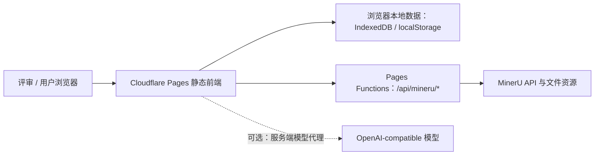

# 知纲快速部署方案

日期：2026-07-15

## 结论

采用 Cloudflare Pages，分两步发布：

1. 先发布静态演示版，尽快获得可公开访问的 `pages.dev` 地址；
2. 再增加 Pages Functions，将现有 MinerU 本地代理迁移到线上。

比赛提交不应等待完整后端。内置示例课程已经能展示知识网络、知识卡片、完整笔记和全库问答，第一步足以生成评审可打开的体验地址。第二步完成后，用户才能稳定上传 PDF/PPTX 并在线调用 MinerU。

## 20 天公开运行策略

使用 Cloudflare Pages 的生产地址，例如 `https://zhigang-demo.pages.dev`。Pages 是持久部署，不需要维持本地电脑或常驻进程；项目不被主动删除时，链接会继续存在。20 天体验期内保留最后一个验证通过的生产版本，不使用临时预览地址作为投稿链接。

Cloudflare Pages 免费方案的静态资源请求免费且不限量；Pages Functions 计入 Workers Free 配额，目前为每天 100,000 次请求。通过 `_routes.json` 让只有 `/api/*` 进入 Function，首页和静态资源不消耗动态请求额度。

建议检查节奏：

- 发布当天：验证首页、示例课程、MinerU Token 链接和一份真实 PDF；
- 第 1、7、14、19 天：分别打开生产地址，走一次示例课程；
- 第 7、14 天：使用小型 PDF 验证 MinerU 上传、轮询和结果下载；
- 第 20 天结束前：不要删除 Cloudflare Pages 项目或更改项目名；
- 若当天 MinerU 或 Pages Functions 达到限额，示例课程仍应可以独立体验。

## 当前项目约束

- 前端是 React 18 + Vite，生产输出目录是 `dist`；
- 课程、聊天和索引主要保存在浏览器 `localStorage` 与 IndexedDB，不依赖数据库；
- MinerU 客户端请求固定走 `/api/mineru/v4/*` 和 `/api/mineru/resource`；
- 这两个接口目前由 `vite/mineru-proxy.ts` 提供，只在 `npm run dev` 和 `npm run preview` 中生效；
- 当前上传上限是 20 MB；
- 知识模型请求目前由浏览器直接发送到 OpenAI-compatible API，是否可用取决于供应商的浏览器跨域策略。

## 推荐架构



静态页面与代理共用一个域名，因此不需要额外处理浏览器 CORS。文件请求由 Pages Function 流式转发，不能先完整读入内存。

## 第一阶段：10 分钟静态演示版

### 目标

获得一个可以直接放进比赛帖子、随时公开访问的链接。评审可以进入首页、载入示例课程并体验主要闭环。

### 发布步骤

```bash
pnpm install --frozen-lockfile
pnpm test
pnpm build
npx wrangler pages deploy dist --project-name zhigang-demo
```

首次执行 Wrangler 时登录 Cloudflare，并确认项目名称。发布成功后会得到类似：

```text
https://zhigang-demo.pages.dev
```

也可以在 Cloudflare Pages 控制台选择 Direct Upload，直接上传 `dist` 文件夹。但控制台拖拽部署不支持编译 Pages Functions，所以只适合第一阶段。

### 能用的功能

- 星空首页与全部页面视觉；
- 内置示例课程；
- 两层知识网络、知识卡片与完整笔记；
- 浏览器本地课程库和聊天记录；
- 不依赖线上代理的本地交互。

### 暂时不能承诺的功能

- 用户上传 PDF/PPTX 后进行 MinerU 在线解析；
- 依赖供应商 CORS 的浏览器直连知识模型。

页面上应把“体验示例课程”作为首要体验入口，不要让评审先配置 API。

## 第二阶段：30–60 分钟完整解析版

### 需要增加的文件

```text
functions/
└── api/
    └── mineru/
        ├── resource.ts
        └── v4/
            └── [[path]].ts
public/
└── _routes.json
```

`[[path]].ts` 接收 MinerU 的多级 API 路径；`resource.ts` 只允许当前代码中已列入白名单的 OpenXLab 与 MinerU 阿里云资源域名。`_routes.json` 只让 `/api/*` 触发 Function，其余请求直接读取静态文件。

### 转发规则

- `/api/mineru/v4/*` → `https://mineru.net/api/v4/*`；
- 只转发 `authorization`、`content-type`、`accept`；
- `/api/mineru/resource?url=...` 继续执行 HTTPS 与域名白名单校验；
- 上传和下载都使用流式 `fetch`，不调用 `arrayBuffer()` 缓冲整个文件；
- 保持当前前端 URL 不变，因此业务组件不需要重写。

Cloudflare Workers 免费账户的请求体上限是 100 MB，高于当前项目的 20 MB 上传限制。相比之下，Vercel Functions 的请求/响应体上限是 4.5 MB，不适合直接承接目前这条文件代理链路。

### 本地与线上验证

```bash
pnpm test
pnpm build
npx wrangler pages dev dist
```

需要验证：

1. 首页、课程库、问答页可以直接刷新；
2. 1 MB 与接近 20 MB 的 PDF 均能申请上传地址并完成 PUT；
3. MinerU 状态轮询可以结束；
4. 结果 Zip 能被下载和解析；
5. 非白名单资源地址返回 403；
6. 未提供 Token 时不会向 MinerU 发出有效请求。

验证通过后再执行：

```bash
npx wrangler pages deploy dist --project-name zhigang-demo
```

Wrangler 会同时发布根目录下的 `functions`。

## API Key 策略

### 比赛阶段推荐：BYOK + 示例兜底

不要把自己的 MinerU 或模型 Key 写进前端代码。继续让体验者在“服务配置”中填写自己的 Key；Key 保存在其浏览器本地。没有 Key 时，始终允许进入示例课程。

这套方案没有公共 API 费用失控的问题，但评审通常不会愿意填写自己的 Key，因此示例课程必须完整、明显、一步可达。

### MinerU Token 申请提示

服务配置页应直接提供官方入口：

```text
没有 Token？免费申请 MinerU Token ↗
官方当前提供每日免费高优先级解析额度，具体以官网为准。
```

申请地址：<https://mineru.net/apiManage/token>

不要写“永久免费”或“无限免费”。MinerU 官方文档当前说明，精准解析 API 需要 Token，并为账号提供每日高优先级解析额度；超过额度后可能降低优先级。官方不同文档页面显示的具体页数可能随版本调整，因此产品只写“含每日免费高优先级额度，具体以官网为准”，不固定承诺页数。

### 若要提供公共 AI 能力

需要再增加服务端模型代理，将 Key 保存为 Cloudflare Secret，并至少加入：

- 单 IP / 单会话速率限制；
- 文件大小与请求次数限制；
- 允许的模型与上游域名白名单；
- 每日预算和自动熔断；
- 必要时使用 Turnstile 防止脚本滥用。

没有这些限制，不建议把个人付费 Key 放到公开 Demo 后端。

## 备选方案

### Vercel 静态部署

优点是导入 GitHub 后几乎无需配置，适合纯展示版。缺点是其 Function 4.5 MB 载荷限制与当前 20 MB 上传代理冲突。若选择 Vercel，MinerU 文件应改成浏览器直传上游，或使用另一套流式代理服务。

### Railway / Render 容器

可以把静态站点和 Node 代理放进同一个容器，迁移思路直观。但当前项目还没有生产 HTTP Server，不能把 `vite preview` 当成长期生产服务器；还需增加服务入口、静态文件处理、健康检查与容器配置。对比赛快速提交而言，操作量和运行成本都高于 Cloudflare Pages。

### HTML Zip

只适合作为备用提交。Vite 构建结果包含 ES Module 和多个资源文件，直接双击 `index.html` 可能受 `file://` 安全策略影响；即使能打开，也没有 MinerU 代理。在线地址应作为主体验方式。

## 决策记录（ADR-001）

### 决策

竞赛版本使用 Cloudflare Pages；先部署静态演示，再迁移 MinerU 代理到 Pages Functions。

### 理由

- 当前项目无需数据库，静态托管最简单；
- 同一平台可以继续承载 `/api/mineru/*`；
- 100 MB 请求体上限能覆盖当前 20 MB 文件；
- 可以先交付公开 URL，再逐步增加完整上传能力；
- 避免为一次比赛展示引入长期运行的容器服务器。

### 代价

- 现有 Vite 中间件不能直接上线，需要移植为 Pages Functions；
- 浏览器本地存储意味着不同设备之间不会同步课程；
- 若开放公共 AI Key，仍需补充限流和预算保护。

## 官方资料

- Cloudflare Pages Vite 构建：<https://developers.cloudflare.com/pages/framework-guides/deploy-a-vite3-project/>
- Cloudflare Pages Direct Upload：<https://developers.cloudflare.com/pages/get-started/direct-upload/>
- Pages Functions 路由：<https://developers.cloudflare.com/pages/functions/routing/>
- Pages Secrets：<https://developers.cloudflare.com/pages/functions/bindings/>
- Cloudflare Workers 限制：<https://developers.cloudflare.com/workers/platform/limits/>
- Vercel Functions 限制：<https://vercel.com/docs/functions/limitations>
- Cloudflare Pages Functions 定价：<https://developers.cloudflare.com/pages/functions/pricing/>
- MinerU Token 申请：<https://mineru.net/apiManage/token>
- MinerU 精准解析 API 与额度说明：<https://mineru.net/apiManage/docs>
