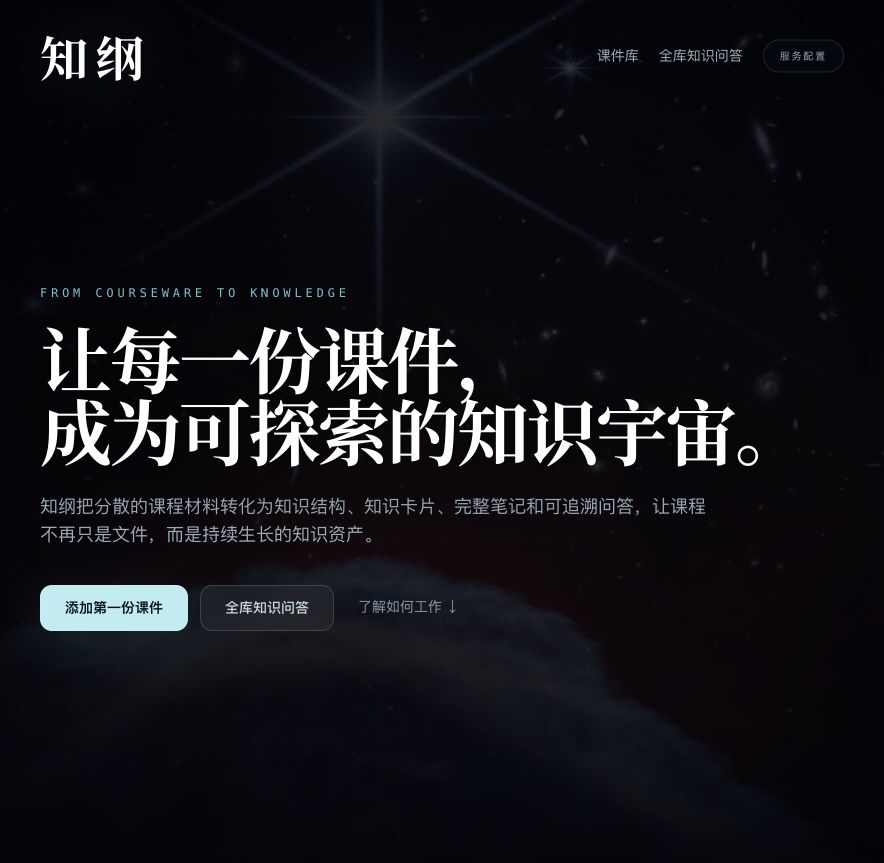
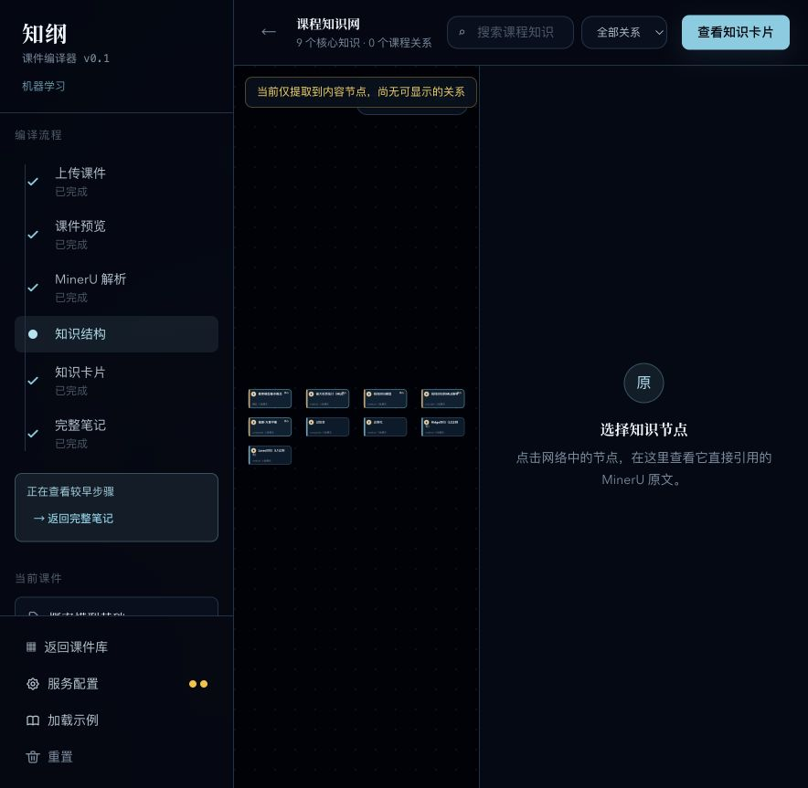
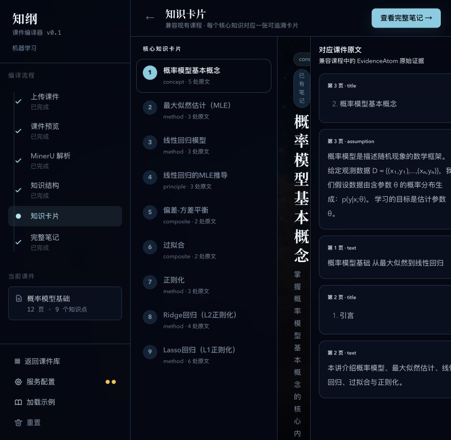
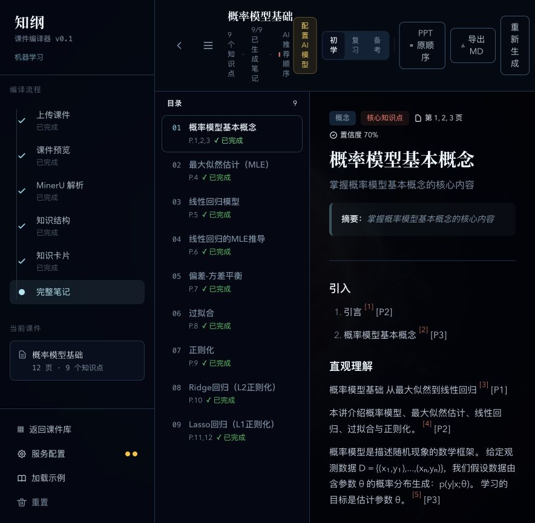
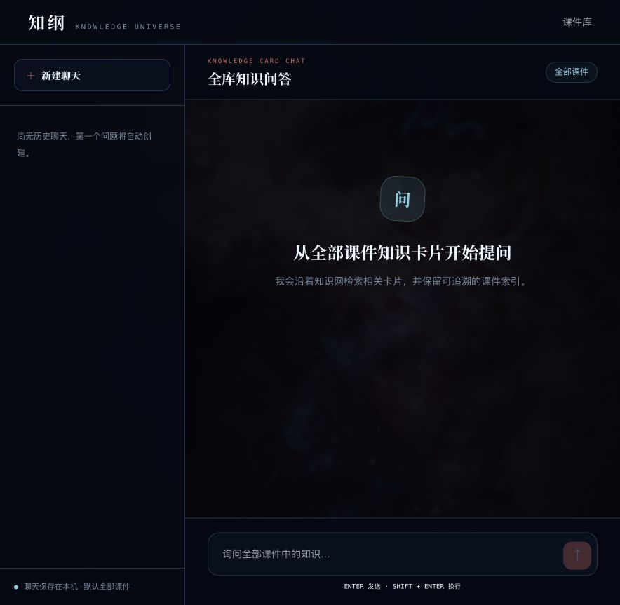

# 【学习工作】知纲：下课了，让课件自己接着长

> 发布前请删掉本文中的提示，并把所有 `【待补】` 替换为真实信息。TRAE 实践过程请以你的真实对话记录为准。

## 标签

#学习工作

## 1. Demo 简介

说起 AI 学习工具，[NotebookLM](https://support.google.com/notebooklm/answer/16164461) 大概是最先被想到的那个。导入 PDF、PPTX、网页、音频，然后对着资料提问，还能生成学习指南、思维导图、音频概览——它已经证明了一件事：AI 能让一堆资料变得好懂、好聊。

用着用着我发现，考试复习这件事，要求其实更苛刻：讲得不漂亮没关系，但知识点不能漏。

平时查资料，我们带着问题去找答案，找着最相关的就行；但复习不一样，课件本身就是考试范围。一个不起眼的定义、公式的适用条件、一个反例，甚至老师塞在角落里的一句话，都可能出现在卷子上。如果模型只挑"最重要"的内容来总结，读起来可能很顺，但心里总不踏实。

老师讲完最后一页，下课了，PPT 就躺在电脑里。

定义、公式、例题都还在。可真到复习的时候，我们还是得一页一页往回翻：这个概念是从哪来的？它依赖什么？后面又引出了什么？课件毕竟是为上课做的——文字要精简，过渡要省略，好多解释是留给讲台上的人的。老师的声音一消失，页面还在，知识点之间的路却暗了。

所以知纲的起点是"课件编译"，而且把"不漏点"放在第一位。整份课件就是考试的边界：先把每一页的原文证据存下来，再整理出知识点清单和它们之间的关系，最后把这些知识节点写成能继续读下去的内容。

知纲是一个 Web 端的课件编译工具。你给它 PDF 或 PPTX，它先用 MinerU 转成结构化的 Markdown，再整理成两层知识结构，最后生成可追溯的知识卡片、完整笔记和全库问答。每个知识点都留着课件原文和页码，读生成内容的时候，随时能走回它的出处。



*图 1：一门课程是一团星云，课件里真正出现过的知识点，就是其中亮着的星。*

知纲是给需要长期整理课程资料的人做的——学生、老师、自学者都算。它面对的是一个挺普通、也挺容易被忽略的问题：课件越攒越多，但真正能被理解、被复习、被重新用上的知识，并没有跟着一起涨。

### 一份课件在知纲里走完全程

```text
导入课件 → 预览原文 → MinerU 解析 → 两层知识结构
         → 知识卡片 → 完整笔记 → 全库知识问答
```

用户只要顺着左边的流程往下走就行。进了 MinerU 就自动开始解析；点了生成完整笔记就直接生成，不会再弹一个确认框问你"确定吗"。

现在的示例课程有 12 页课件，系统从里面整理出 9 个知识点，对应 9 张可追溯卡片和 9 章连续笔记。就算不配置任何外部服务，也能用示例课程把整条主链路走一遍。这是一个能动手操作、能验证的 Demo，不是一张概念图。

## 2. Demo 创作思路

### 我想整理的，其实是考试范围

最开始我也想过，要不就给每份课件生成个摘要吧。但摘要只是把五十页压成五页——内容变短了，知识之间的距离并没有消失。

NotebookLM 擅长围绕一堆资料来理解、提问、生成内容。知纲把范围收得更窄：就盯着课程考试。而且多了一件更严格的事——整份课件都要进入覆盖检查，每个识别出来的知识点，都得有出处、有生成状态、有复习的位置。

| 对比维度 | NotebookLM | 知纲 |
| --- | --- | --- |
| 组织单位 | 围绕一组来源建立 Notebook | 围绕一门课程持续积累课件 |
| 主要入口 | 与来源对话，生成多种学习内容 | 沿课程结构浏览、复习和提问 |
| 考试目标 | 帮助理解来源并生成学习材料 | 按课件范围进行覆盖式梳理，尽量不遗漏可考知识点 |
| 知识结构 | 可以生成交互式思维导图 | 两层知识网络是卡片、笔记和问答共用的数据底座 |
| 课件处理 | 把课件作为可引用来源 | 逐页建立证据，再编译为知识点、学习顺序和连续笔记 |

真正影响长期学习的，是一次生成之后留下了什么。知纲的做法是：先存证据，再搭结构，最后生成笔记和问答。

知识点先跟课件页码绑死，之后的卡片、笔记、回答，都共用同一份证据。你读到一段通顺的话，也能知道它是从哪来的。

### 为什么考试场景不能漏知识点

对考试来说，"讲得深"和"覆盖得全"是两回事。一份只留重点的好笔记，说不定刚好删掉了老师想考的那个细节。所以知纲不会直接让模型自由总结整份课件，而是先把页面切成一个个可以检查的内容窗口，从每个窗口里提取候选知识点，再合并、消歧。

每个知识点都记着引用了哪几页、有多少条原文；卡片是按完整的知识点清单生成的；完整笔记会显示已完成的章节数，比如示例课程里的"9/9 已生成"。如果某个窗口或某一章生成失败了，系统会明明白白显示失败状态，允许重试，已经做好的内容也不会丢。遗漏的风险，不能被一段看起来很完整的文字悄悄盖过去。

当然，这里说的"不漏点"是一套可以检查的产品目标，不是说 AI 就不会犯错了。正因为 AI 可能犯错，用户才必须能核对：课件是不是逐页进了证据层？知识点是不是都有出处？每个节点是不是都已经生成了卡片和笔记？

### 为什么要先搭知识框架

一个概念如果没有位置，你很难判断它是基础、是方法，还是某个结论的前提。九个知识点平铺着放，就是九段独立的内容；放进框架里，学习者才能看出来哪些该先学、哪些挨得近、下一步可以往哪走。

框架也让后面的功能有了共同的底座：知识卡片按节点生成，完整笔记按知识关系组织，全库问答沿着卡片和课程来检索。三个入口用的是同一套知识结构，只是分别服务于复习、阅读和追问。

### 为什么只做两层知识结构

层级不是越多越好。

只有一层的话，课程名称、章节标题、具体概念全挤在一张图上，资料一多就乱了；再往下细分好多层呢，用户又得维护一棵复杂的目录树。

知纲只留了两个真正有用的观察尺度：

- 课程层——回答"我的知识分布在哪"，每门课是一个独立的区域；
- 知识点层——回答"这门课具体要学什么"，概念按依赖关系和学习顺序排开。

用户先看到全部课程，再钻进某一门课看具体的知识点。课程和知识点的数量，都由实际的课件决定，不用预设上限。远看是星云，凑近了才看见一颗颗星。



*图 2：进入课程后，知识点按学习顺序出现；点一下节点，就能核对它引用的课件原文。*

### 有了框架，为什么还要笔记

知识框架能告诉你先学什么，但代替不了讲解。

课件上的一句话，往往依赖老师当时说过的解释；一张知识卡片能把单个概念讲清楚，但一直在卡片之间跳来跳去，学习还是断的。知纲先生成可追溯的卡片，再按照知识关系把卡片组织成连续的笔记，把概念之间的过渡、推导、例子补回来。

课件是按课堂展示的顺序翻页的，笔记是按理解一个问题所需要的顺序展开的。它不会取代课件——拿不准的时候，你仍然可以通过引用回到原始页码。



*图 3：卡片和课件原文并排显示，每条讲解都能找到依据。*



*图 4：卡片被组织成可以连续阅读的课程笔记，页码和引用都还在。*

### 它在实际学习中改变了什么

复习一个概念，不用再翻完整份课件，从知识卡片就能直接看讲解和原文；想系统过一遍，就进完整笔记；遇到跨课程的问题，可以向全部课件提问，再沿着引用回到具体材料。

这三个入口用的是同一份知识数据。整理工作只做一次，之后可以反复读、反复查、反复问。课程、聊天记录和索引主要存在浏览器本地，关了页面也不会立刻没了。



*图 5：全库问答沿知识卡片检索内容，并保留课件索引。*

### 为什么用"知识宇宙"来呈现

星空在这里不只是装饰，它在表达数据。

每门课程聚成一团星云，每个有课件证据支撑的知识点，才会亮起来。没有课件的时候，背景还留着微弱的星光；课程越多，星云越多；一门课里的知识点越多，里面的亮星也越密。

首页支持缩放和边缘移动，用来装下未知数量的课程。课件库、全库问答和工作区，用的是不同的真实星云背景，再用暗色遮罩和半透明面板把背景压下去——视觉负责传递"知识在增长"的感觉，内容始终保持最高对比度。

## 3. Demo 体验地址

【待补：公开体验地址】

建议体验路径：

1. 首页点"添加第一份课件"；
2. 进入课程空间后选"体验示例课程"；
3. 依次看看两层知识结构、知识卡片和完整笔记；
4. 返回首页，进"全库知识问答"试试。

没配置 MinerU 或知识模型的时候，示例课程也能完整体验。要上传自己的 PDF/PPTX 并在线解析的话，需要在服务配置里填上对应的 API。

如果用 HTML Zip 提交：

【待补：Zip 附件名称与打开方式】

## 4. TRAE 实践过程

知纲是一轮一轮 TRAE 任务堆出来的。从需求拆解、架构选择、界面实现，到问题定位和回归验证，TRAE 全程都在。

### 第一阶段：把模糊想法变成能落地的结构

最开始的需求就一句话：能不能把课件整理成知识，而不是再生成一份摘要？

我跟 TRAE 接着往下抠：生成内容怎样回到原文？课程和知识点怎么共存？卡片和笔记应该是什么关系？最后磨出了"课件解析 → 原文证据 → 两层知识结构 → 知识卡片 → 完整笔记 → 全库问答"这条流程，也围绕页码、证据范围、知识节点和课程关系，把数据结构定了下来。

这一阶段的技术取舍，可以概括成"证据优先"。先把稳定的原文身份建立好，再让模型去生成上层内容。就算以后换了模型，知识点跟课件之间的联系也还在。

【待补：TRAE 截图 1，需求拆解、数据结构或架构对话】
Session ID：`【待补：真实 Session ID 1】`

### 第二阶段：跑通一份课件的完整旅程

接下来，我通过 TRAE 实现了 PDF、PPTX 导入和 MinerU Markdown 解析，再把带页码的原文送进知识生成流程。系统先识别和合并知识点，再生成卡片、学习顺序和完整笔记。

这条链路既要处理正常结果，也得面对配置缺失、解析失败、旧数据迁移、生成中断这些情况。所以 Demo 里加了配置保存与恢复、明确的失败状态、局部重试，还有示例课程——不至于因为某一章失败了，就得重做整门课。

【待补：TRAE 截图 2，MinerU 解析、知识生成或失败恢复任务】
Session ID：`【待补：真实 Session ID 2】`

### 第三阶段：让功能从"能跑"变成"顺手"

好多迭代都来自真实操作里的小问题：进了 MinerU 就该直接解析；点生成完整笔记就别再确认一次；Markdown 的公式和列表必须正确显示；二级知识网络不能暗到看不清；课件库和全库问答都得能回到首页。

我把这些问题一个个扔给 TRAE。它先定位状态和组件，再改实现、补测试，最后重新跑页面验证。用户反馈里的"多点了一下""太暗了""回不去了"，都被转成了可以检查的行为。

【待补：TRAE 截图 3，交互问题定位、修复与测试结果】
Session ID：`【待补：真实 Session ID 3】`

### 第四阶段：让数据真正点亮星空

视觉改造也走了好多轮 TRAE 对话。首页从装饰性的星空，慢慢变成了数据驱动的课程星云；不同页面用了不同的天体照片；星云背景压暗了亮度，知识网络则提高了节点、文字和连线的对比度。

整个过程一直跟着自动化验证。目前项目有 81 个测试文件、999 个测试用例，覆盖了课件库、MinerU 流程、两层知识网络、Markdown 渲染、知识卡片、完整笔记、全库问答和主要导航。生产构建也已经通过。

【可选：TRAE 截图 4，星云视觉迭代或完整测试结果】
Session ID：`【可选：真实 Session ID 4】`

## 开发心得

写出第一个页面不难。真正耗时间的，是不断遇到"为什么这里还要再点一下""这段内容为什么找不到原文""这张图为什么看不清"，然后一个一个把问题改掉。

TRAE 缩短了从想法到可运行页面的距离，也让我更早看见想法里的漏洞。它能快速给出实现，但课程该怎么组织、哪些内容必须可追溯、什么时候该删掉一次点击——这些还是得我在真实使用里去判断。

知纲现在已经跑完了一条可以实际体验的学习链路：一份课件进了系统，会留下结构、卡片、笔记，还有可以检索的知识。下一次打开它的时候，你面对的不再只是一份沉默的文件。

## 社区报名帖

【待补：通过审核的社区报名帖链接】

---

## 发布前删除的检查项

- [ ] 确认"学习工作"与报名赛道一致；
- [ ] 上传产品截图，并替换本文中的本地图片路径；
- [ ] 补公开体验地址或 HTML Zip；
- [ ] 补不少于 3 张真实 TRAE 开发截图；
- [ ] 补不少于 3 个真实 Session ID；
- [ ] 补社区报名帖链接；
- [ ] 删除提示文字和本检查项。
